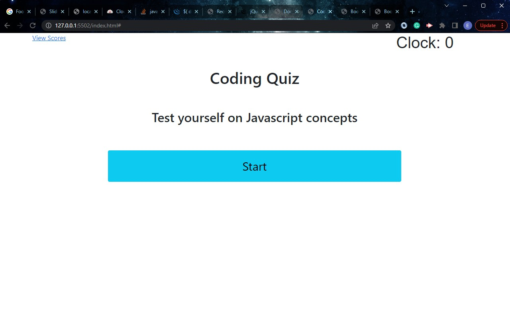

# Code-MultipleChoice-Quiz

## Multiple Choice Coding Quiz

This web application helps users to test their knowledge in JavaScript concepts. 
It is designed in a multiple choice question format where the user answer series of questions and get a score in the end. The project has contributed a lot to my coding mindset interms of logic and meeting the requirements.

## Usage

The user is presented with a starting page and when he/she click on the "Start" button, the question and multiple choice answers get displayed. When the user answer's the question right, the text "Correct" is displayed at the buttom and when it is incorrect, a text "Wrong" with the right answer is displayed. After that, the next question is displayed till the last question. This is all done under a timer. after answering all the questions, the score is computed and the user will be required to enter his/her initials to get their overall total score.  

The following image demonstrate the web application and functionality. Also, below is a link to the deployed web application. 

https://eugenestar5.github.io/Code-MultipleChoice-Quiz/

